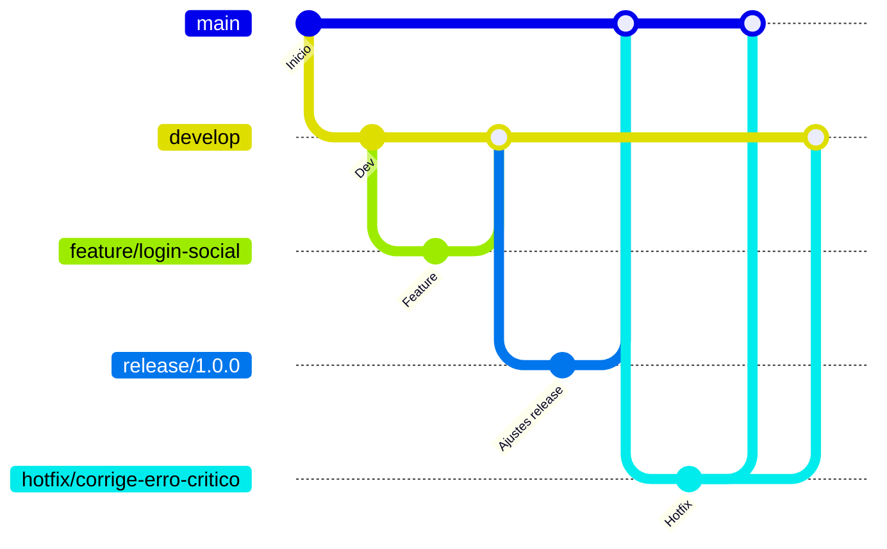

# Gitflow para o Projeto

Este documento descreve o fluxo de trabalho Gitflow sugerido para o projeto, incluindo a nomenclatura das branches (ramificações).

## Branches principais

- **main**  
  Contém o código de produção. Toda entrega de versão estável é feita nesta branch.

- **develop**  
  Contém o código de desenvolvimento integrado. Novas funcionalidades e correções de bugs são integradas aqui antes de irem para a main.

## Branches secundárias

### 1. Feature Branches

- **Propósito**: Desenvolvimento de novas funcionalidades.
- **Nomenclatura**:  
  `feature/<nome-da-funcionalidade>`  
  **Exemplo**:  
  `feature/login-social`

### 2. Bugfix Branches

- **Propósito**: Correção de bugs identificados durante o desenvolvimento.
- **Nomenclatura**:  
  `bugfix/<descricao-do-bug>`  
  **Exemplo**:  
  `bugfix/corrige-erro-login`

### 3. Release Branches

- **Propósito**: Preparação para uma nova versão de produção.
- **Nomenclatura**:  
  `release/<versao>`  
  **Exemplo**:  
  `release/1.2.0`

### 4. Hotfix Branches

- **Propósito**: Correções críticas em produção.
- **Nomenclatura**:  
  `hotfix/<descricao-do-hotfix>`  
  **Exemplo**:  
  `hotfix/corrige-erro-critico`

## Fluxo de trabalho resumido

1. **Nova feature:**  
   Crie a partir de `develop` → `feature/nome-da-feature`  
   Ao finalizar, faça merge em `develop`.

2. **Bug durante desenvolvimento:**  
   Crie a partir de `develop` → `bugfix/descricao-bug`  
   Ao finalizar, faça merge em `develop`.

3. **Preparação de release:**  
   Crie a partir de `develop` → `release/versao`  
   Ao finalizar, faça merge em `main` e `develop`.

4. **Hotfix em produção:**  
   Crie a partir de `main` → `hotfix/descricao-hotfix`  
   Ao finalizar, faça merge em `main` e `develop`.

---

## Exemplo visual

